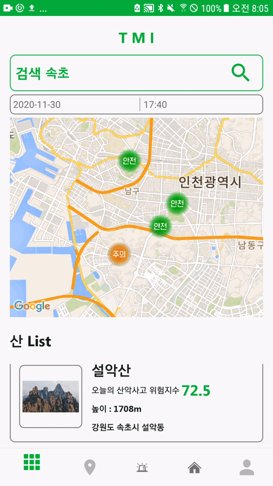
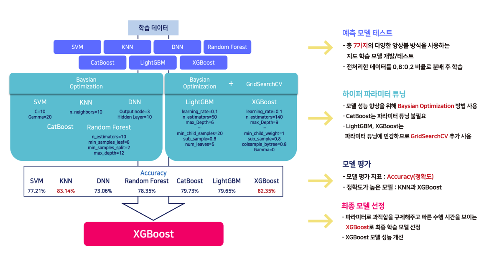
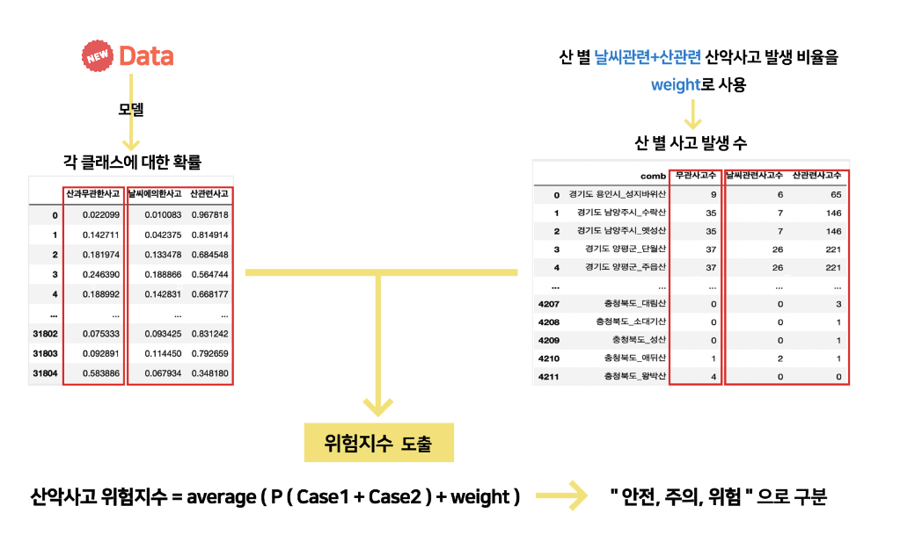
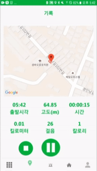
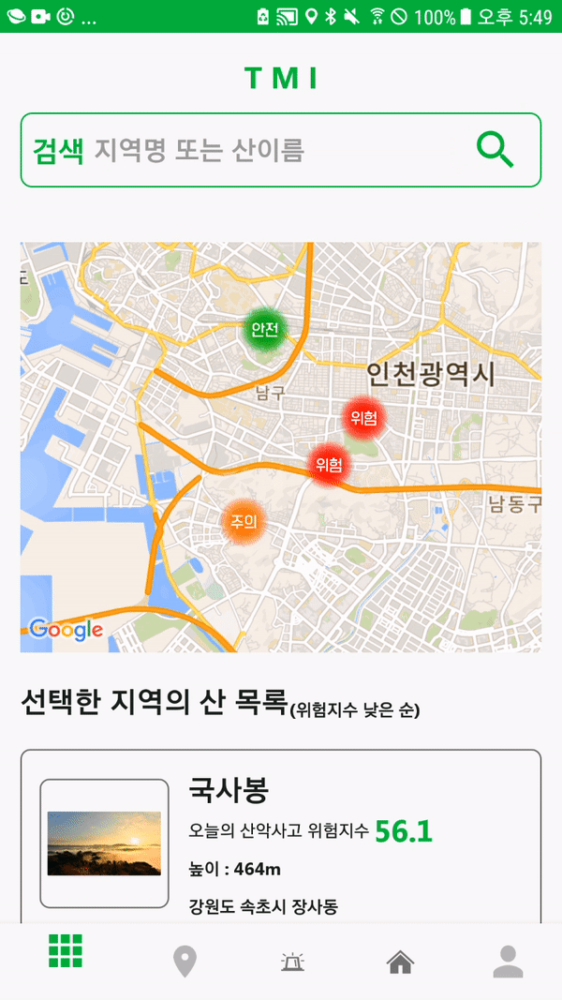
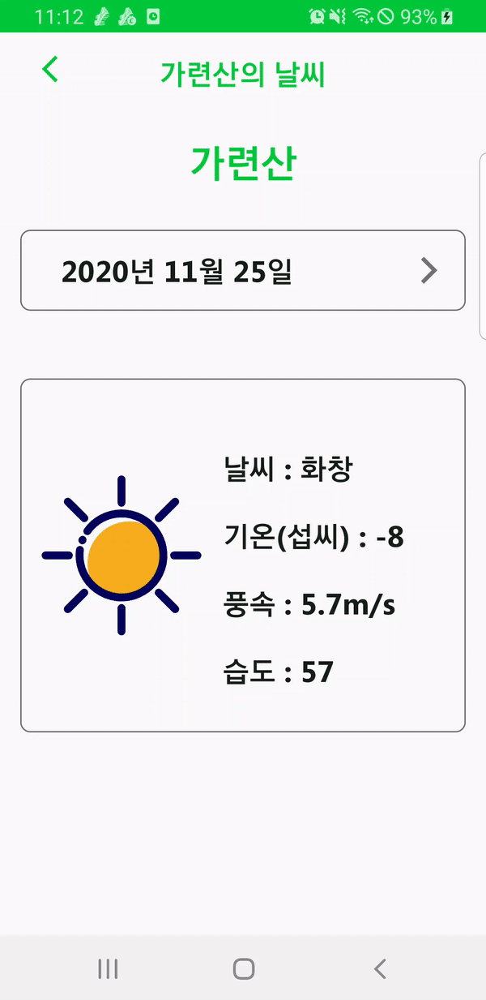
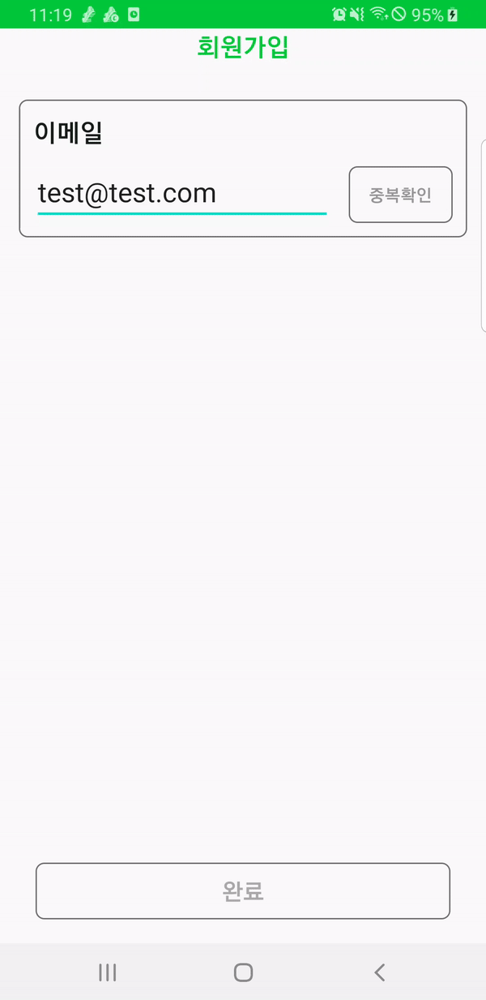

# TMI - Today's Mountain Information

> 2020년 2학기 컴퓨터 공학 종합 설계 - 팀 GCG 프로젝트

## Features 🌟

  

**안전한 산행을 위해 산악인들에게 머신러닝을 기반으로한 산의 위험정도를 측정하여 알려주고 기타 기능들을 담은 어플리케이션**

---

### Contributors :sparkles:
<table>
  <tr>
    <td align="center"><a href="https://github.com/kwonsehee"> <b>권세희</b></a> <a href="https://github.com/Grace-Girls/GCG/commits?author=kwonsehee" title="Code">💻 DB</a></td>
    <td align="center"><a href="https://github.com/HyeRyeongKang"> <b>HYERYEONG KANG</b></a> <a href="https://github.com/Grace-Girls/GCG/commits?author=HyeRyeongKang" title="Code">💻ML</a></td>
    <td align="center"><a href="https://github.com/ParkSungHee"> <b>ParkSungHee</b></a> <a href="https://github.com/Grace-Girls/GCG/commits?author=ParkSungHee" title="Code">💻안드로이드 개발</a></td>
    <td align="center"><a href="https://jjjoonngg.github.io"> <b>Jong Sin Kim</b></a> <a href="#projectManagement-JJJoonngg" title="Project Management">📆</a></td>
  </tr>
</table>

#### Reposioty :floppy_disk: - Private 

---

### Database - ERD

- Machine Learning

 
---

### Fucntions :hammer_and_wrench:

---

#### Function -  :one:

머신러닝을 통해 산의 위험도를 측정하여 각 산별로 위험지수를 보여주는 기능

- :sun_behind_large_cloud: 기상 관측 정보  - (출처 : 기상청 기상자료 개방 포털)
- :world_map: 관측 지점 정보 - (출처 : 기상청 기상자료 개방 포털)
- :city_sunset: 일몰 일출 데이터 - (출처 : 한국 천문 연구원)
- :hospital: 산악 사고 데이터 - (출처 : 소방청)
- :mountain: 산 정보 - (출처 : 산림청)

**데이터 전처리**

- 결측값
  - 강수량 과 적설량 NULL => 0 으로 처리
  - 기온, 풍속, 습도, 이슬점 온도 NULL => KNN 사용하여 값을 넣어줌
- 정규화
  - Displot, boxplot 시각화로 데이터들의 왜곡 정도 파악 후 강수량, 적설 column 을 정규화

---

#### Function - :two:

현재 위도와 경도를 받아서 구조요청을 할 수 있는 기능 :sos:

 

---

#### Function -​ :three:

구글 맵스를 이용하여 현재 위치를 기반으로 하여 경로를 지정하고, 해당 기록에 대한 정보를 저장 하는 기능

  

---

#### Function - :four:

[open weather map api](https://openweathermap.org/) 를 이용하여 현재 위치, 날짜를 이용 하여 날씨를 받아올 수 있도록 구현

---

#### Function - ETC :exclamation:

- 로그인 기능 및 회원 가입

   

---

#### Library & API :book:

- `Firebase`
- `Ted Permission`
- `Google Auth`
- `Glide`

- `LocationListener - GPS_PROVIDER`

- `Open Weather Map`

---

